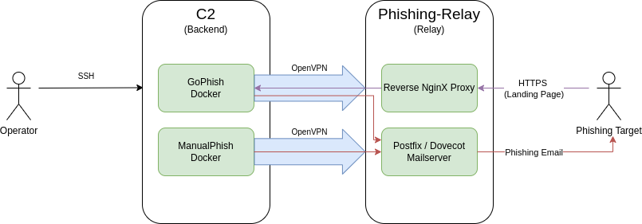
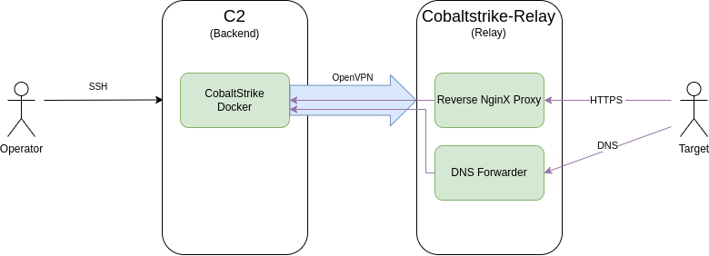
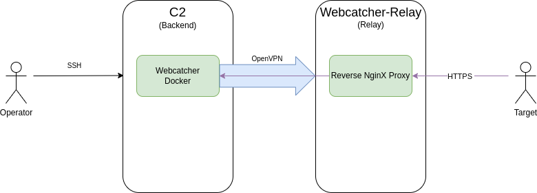
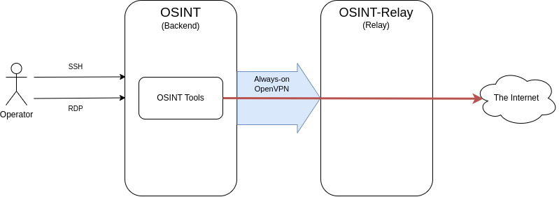

<p align="center">
  
</p>
<h4 align="center">
  <i>Red Wizard!</i> 
  <br>
  <br>

</h4>

___
 [Quick Start](#quick-start) - [Architecture](#architecture)  - [Components](#components)

___

## Introduction

Welcome to Red Wizard, an open-source tool designed to provide repeatable, OPSEC-safe infrastructure for Red Teaming operations. Red Wizard was created to address the challenge faced by many serious Red Teams, where publicly available deployments are either limited or not user-friendly, requiring additional time and work from infrastructure maintainers and operators.

Red Wizard automates the deployment of a comprehensive infrastructure with redirectors, backend systems, phishing relays, OSINT machines, and more. The tool is designed to be user-friendly, providing wizards to walk administrators and Red Team operators through the deployment process. The infrastructure is also self-documenting, making the sharing of all relevant details to the team of operators an effortless task.

The tool is built with resilience in mind, ensuring an OPSEC-safe setup by retrieving all critical key material from the deployed servers, enabling you to rebuild and keep receiving your shells even if one of your servers crashes and burns. Red Wizard is mainly based on Ansible and Docker, making it easy to deploy and manage.
___

## Quick Start

### Requirements

We kept the requirements for Red Wizard as simple as possible:

* Ubuntu 22.04 on the deployment system (Your laptop or a VM is fine) with a 16G root partition. 
* Clean Ubuntu 20.04 on all target machines (Will support 22.04 in the near future)
* 1 deployment user (Configured for key-based SSH access on all machines)
* Deployment user has identical sudo password on all machines

Unlock your ssh key and you are good to go.

### Initial first time setup for your team:

On your deployment machine install required packages

```bash
> ./step-0-first-time-setup.sh
```

Next, Edit the globals.yml file and add the information for your team.
The default password is 'ansible':

```bash
> ansible-vault edit globals.yml
```

Finally set a sensible password for your globals.yml via:

```bash
> ansible-vault rekey globals.yml
```

### Creating a configuration for a Red Teaming engagement:

For an interactive configuration, run:

```bash
> ./step-1-create-configuration.py
```

Check the advanced options if you want to automate this part:

```bash
> ./step-1-create-configuration.py -h
```

### Next, create your system inventory:

Start by running the following, targeting the configuration directory you created in step 1:

```bash
> ./step-2-create-inventory.py ../../<configuration directory>/

Please choose your action
1 Add Server (Basic Building Block)
2 Show Current Inventory
3 Save Updated Inventory
x Exit
```

Start by choosing option 1 (Add Server), these are the basic building blocks of the configuration. A server can either be a backend or a relay:


| Backend       | Relay         |
| ------------- | ------------- |
| Not exposed to the internet | Exposed to the internet and forwards the correct traffic types to the backends |
| The place where the Red Team operators perform their tasks  | Usually no actions from operators are needed here  |
| Usually a stable component in a Red Teaming assessment | Can be burned at will after detection |

A typical Red Teaming engagement can for example consist of the following structure:

| Type | Name | Description |
| ---- | ----- | ---- |
| `Backend` | C2 | This Command and Control server runs all important components, your Cobalt Strike instances, phishing servers, hardware implant backends etc. |
| `Backend` | OSINT | A machine with Desktop access and an always-on VPN connection to hide the traffic source |
| `Relay` | Relay-Malware | Forwards CobaltStrike traffic to C2 |
| `Relay` | Relay-Phishing-Campaign A | Mailserver and reverse nginx proxy for phishing campaign A, relays to GoPhish on C2 |
| `Relay` | Relay-Phishing-Campaign B | Mailserver and reverse nginx proxy for phishing campaign B, relays to GoPhish on C2 |
| `Relay` | Relay-Dropbox | Provides port-forwarding functionality for hardware implants to reach the dropbox-backend on the C2 |
| `Relay` | Relay-OSINT | Hides the backend OSINT server by providing an always-on VPN connection |

Note that additional options are unlocked once servers are added. When you are done with the basic building blocks, safe your configuration with the following option 

```bash
Please choose your action
1 Add Server (Basic Building Block)
2 Add Phishing Campaign
3 Add Webcatcher Campaign
4 Add OSINT Campaign
5 Add CobaltStrike Campaign
6 Add Dropbox Campaign
7 Show Current Inventory
*8 Save Updated Inventory*
x Exit
```

You can use this step as many times as you want, even on an existing configuration. For example to add a new phishing campaign.

___

### Deployment

Once you are happy with your infrastructure, you might want to review it by creating an overview graph:

```bash
./tools/diagram.py <config directory>
```

If everything is good to go deploy your complete infrastructure with the following command:

```bash
./step-3-deploy-infra.sh <config directory>
```

Alternatively if you just want to deploy a certain part (for example new users to all systems) you can make use of the tag system with:

```bash
./step-3-deploy-infra.sh <config directory> <tags>
```

Deployment tags can be viewed via:
```bash
./tools/list-tags.py
```

After deployment follow the messages and get your DNS configurations by running 

```bash
cat <config dir>/Exports_Autogenerated/dns_configs/*
```
___


## Architecture

### Features and OPSEC considerations

Currently the following components are publicly released:

* GoPhish
* Manual Phish
* CobaltStrike
* OSINT
* Web Catcher
* Dropbox (Hardware implant)

What did we not release? What do you have to do yourself?

* Secura’s Red Teaming secret sauce
** OPSEC patches to GoPhish / Cobaltstrike etc
** Malleable Profiles (You can place your own in roles/backend-cobalt-strike/templates/) (Place your own for exmple in roles/backend-gophish/files/gophish/files, gophish_goget.sh already has a provision for a patch file)
* Other components for proprietary software 
* Not all hardenings for our environments
* Relay website-generators
* Server deployment

### Logging everything

You might notice that on the C2 you will have to exit twice to leave the server, that is because you are automatically working in an asciinema subshell to log all commands.

There are 3 types of logging active on the C2:

* asciinema for all commands and output
* /var/log/commands/commands.log that includes all commands of all users
* tcpdump logging of all network traffic in /var/log/tcpdump/

### Design principles

Red Wizard was build around the following design principles:

* Simplicity trumps fanciness
* Operational Security (OPSEC)
* Must be robust
* No magical Black Boxes
* Everything must be self-documenting
* Easily extendable
* Preconfigured listeners / phishing profiles
* Log everything

___


## Components

### Phishing

For the phishing components, Red Wizard installs a mailserver on the relay. Any component can make use of this mailser. By default 2 components are deployed for it:

* GoPhish (on the C2, with preconfigured sending profiles)
* ManualPhish (on the C2, with a preconfigured sending profile)

This deployment makes use of the following setup:

<p align="center">
  
</p>
<h5 align="center">
  <i>Red Wizard phishing infrastructure</i> 
  <br>
  <br>

</h4>

Usage information:

Start by getting the configured URLs that you can use for your landing page by logging in to the phishing-relay:

```bash
ssh <Your Designation for the relay server>

```

The welcome message will display the URL's that will be forwarded to the GoPhish instance.
Save the URL to use as the URL for the GoPhish campaign. (When setting up the campaign in GoPhish)

Next, connect to GoPhish:

```bash
ssh <Your Designation for the C2-Server>
```


Use your browser to navigate to:

```bash
http://localhost:<designated port>
```

Log-in to gophish using the preconfigured password.
Now you can configure your GoPhish campagin.

For the manual phish use docker-info.sh and docker-interact.sh to interact with the deployed manual phish container.
The welcome message shows the steps you can take to send out a mual phishing email from your command line via the deployed mailserver.

### CobaltStrike

For the cobaltstrike components, Red Wizard installs a reverse-nginx for https traffic and a dns forwarder on the relay. On the C2 the following component is installed:

* CobaltStrike (on the C2, with preconfigured HTTPS and DNS listener)

This deployment makes use of the following setup:

<p align="center">
  
</p>
<h5 align="center">
  <i>Red Wizard cobaltstrike infrastructure</i> 
  <br>
  <br>

</h4>

Usage information:

By using the provided SSH configuration you already should have a forwarded port to the C2 server by SSHing into it.

Next run your cobaltstrike instance connecting to localhost with the configured port and the preconfigured password.

You should see 2 preconfigured listeners, one for DNS and one for HTTPS. You can use this information to spin up your own listeners.

### Webcatcher

This component stores arbitrary get and post requests in a log file. useful for example monitoring callbacks.
For the webcatcher components, Red Wizard installs a reverse-nginx for https traffic on the relay. On the C2 the following component is installed:

* Webcatcher


This deployment makes use of the following setup:

<p align="center">
  
</p>
<h5 align="center">
  <i>Red Wizard webcatcher infrastructure</i> 
  <br>
  <br>

</h4>

Usage information:

Start by getting the configured URLs that you can use for your landing page by logging in to the webcatcher-relay:

```bash
ssh <Your Designation for the relay server>

```

The welcome message will display the URL's that will be forwarded to the webcatcher instance.
Visit the URL and check if the request was received by the webcatcher:

```bash
ssh <Your Designation for this C2-Server>
cat /TOOLKIT/web-catcher/docker/Nginx-Webcatcher-Callback/logs/requests.log
```


### OSINT

This component differs from other Red Wizard components by being the only component that can be deployed on a backend. No other components can be combined.

The OSINT roles installs a desktop for the backend server and allows for RDP access via an SSH forward. 

All traffic from this component is routed via an always-on VPN through the relay:

<p align="center">
  
</p>
<h5 align="center">
  <i>Red Wizard osint infrastructure</i> 
  <br>
  <br>

</h4>


